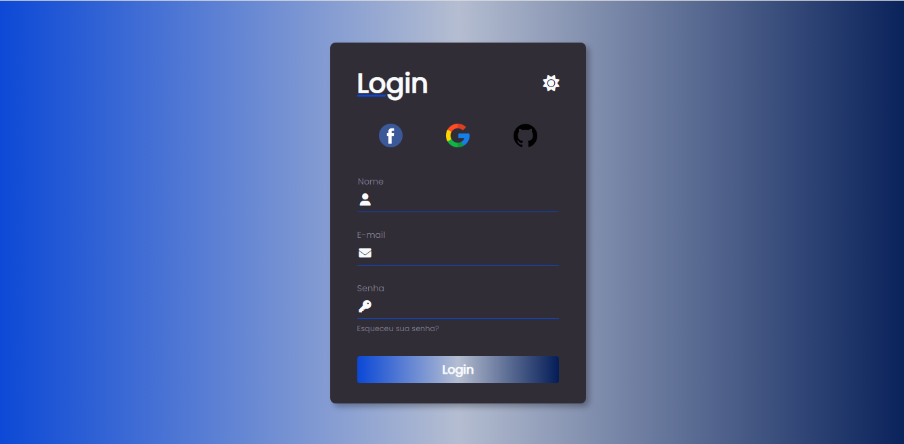
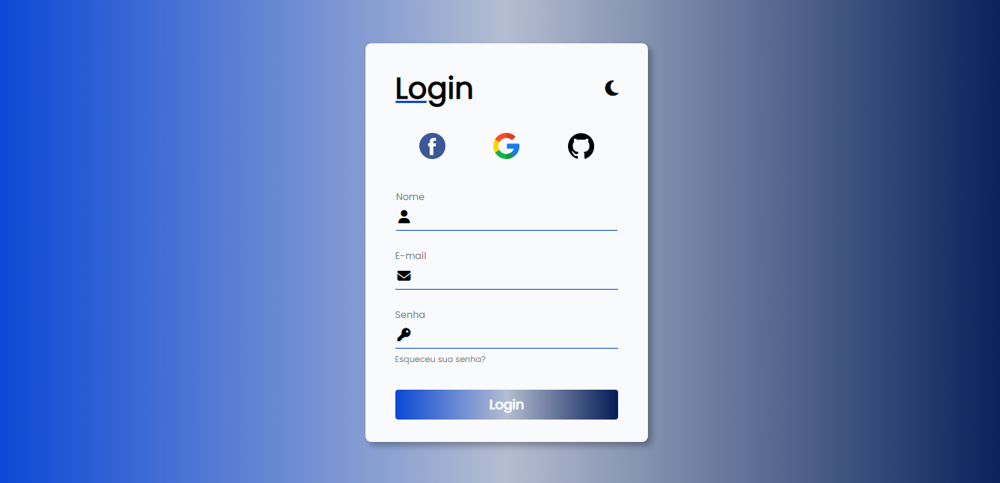

# Formulário de Login Dark/Light

Este é formulário interativo, onde o usuário muda a cor do formulário. O formulário muda pra cor Dark ao clicar no ícone da lua, e volta a cor original ao clicar no ícone do sol. Utilizei o basico de JavaScript para fazer essa animação.

# Login Dark e Light

Link para acessar o projeto : (https://ivysonribeiro.github.io/Login-Dark-e-Light/index.html)

## Tecnologias

- HTML
- CSS
- JavaScript
- Git
- GitHub

 
